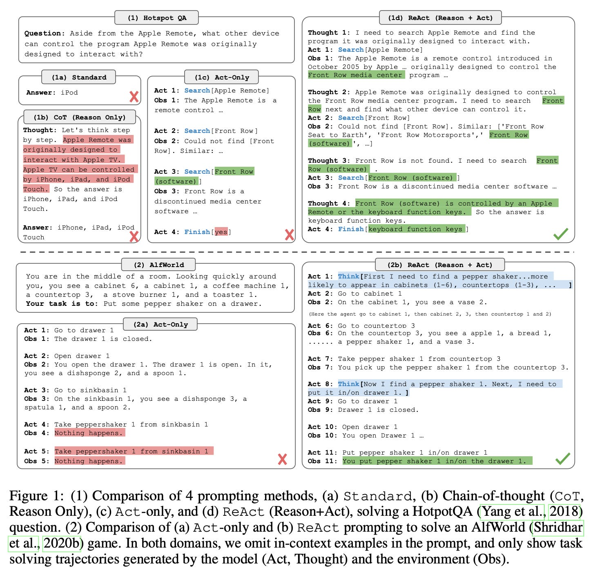

# 🚀 ReAct Agent Implementation from Scratch with LangChain 🧠


## 📝 Overview

This project showcases the creation of a ReAct (Reasoning and Acting) agent using the LangChain library. The ReAct framework is a powerful approach that combines reasoning capabilities with actionable outputs, enabling language models to interact with external tools and answer complex questions. This implementation leverages the `ChatOpenAI` model from OpenAI and integrates seamlessly with tools such as Wikipedia search and text length calculation.

## ✨ Features

- **🔗 ReAct Framework**: Implements the ReAct framework to enhance the agent's ability to reason and act based on the input it receives.
- **🛠️ Custom Tool Integration**: Integrates custom tools like text length calculation and Wikipedia search/lookup to enrich the agent's functionalities.
- **⚙️ Environment Configuration**: Efficiently manages configuration settings using environment variables, ensuring flexibility and security.
- **🔍 Logging**: Implements detailed logging to facilitate debugging and monitor the agent’s decision-making process.


## 🚀 Getting Started

### 1️⃣ Clone the Repository:

```bash
git clone https://github.com/n-mhatre/ReAct-Agent-Implementation-from-Scratch-with-LangChain.git

cd react-agent-langchain
```

### 2️⃣ Install Dependencies:
Ensure Python 3.9 or later is installed. Then, install the required packages:
```bash
pip install -r requirements.txt
```

### 3️⃣ Configure Environment Variables:
Create a `.env.secret` file in the project root directory and add your OpenAI API key:
```bash
OPENAI_API_KEY=your_openai_api_key
```
### 4️⃣ Run the Project:
Execute the Jupyter notebook (.ipynb) to see the ReAct agent in action. The notebook contains step-by-step implementations of the ReAct agent, from tool definitions to prompt templates and agent logic.

## 📂 Code Structure
- `react_agent.ipynb`: Contains the complete implementation of the ReAct agent, including the logic for tool integration, prompt templates, and agent reasoning.
- `requirements.txt`: Lists all the dependencies required for the project.


## 🔧 Tools & Technologies Used
- **LangChain:** For building and integrating the ReAct agent framework.
- **OpenAI API:** To leverage the `ChatOpenAI` model for natural language understanding and generation.
- **Wikipedia API:** For retrieving information from Wikipedia as part of the agent's toolset.
- **Python:** The core language used for scripting and logic.

## 📚 References
- [📝 Paper - Chain-of-Thought Prompting Elicits Reasoning
in Large Language Models](https://arxiv.org/pdf/2201.11903)
- [📖 A Deep Dive into ReAct Agents](https://medium.com/@AbhiramiVS/a-deep-dive-into-react-agents-99cef47aa8dc)
- [🛠️ Build LLM Agent Combining Reasoning and Action: ReAct Framework Using LangChain](https://medium.com/@jainashish.079/build-llm-agent-combining-reasoning-and-action-react-framework-using-langchain-379a89a7e881)

## 🙌 Acknowledgments
Special thanks to the LangChain community and the creators of the ReAct framework for their invaluable contributions to the field of AI. Also, a shoutout to the authors of the referenced papers and blogs that inspired me for this project.